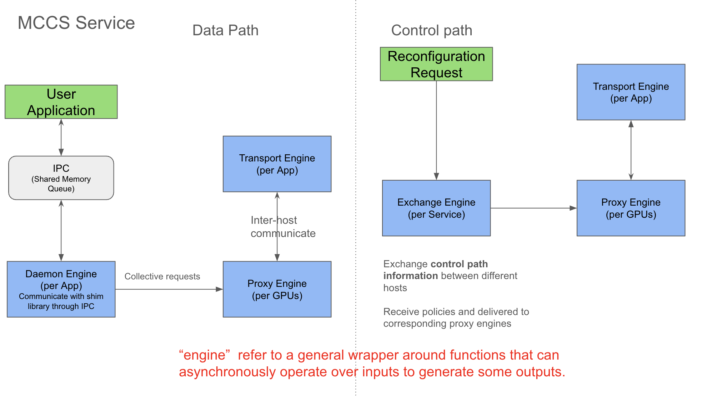
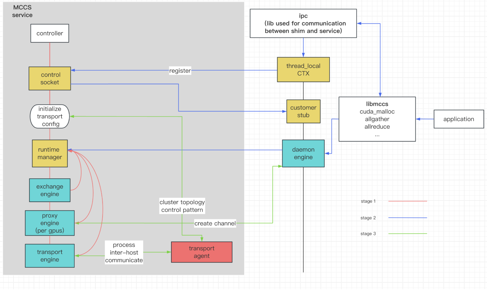
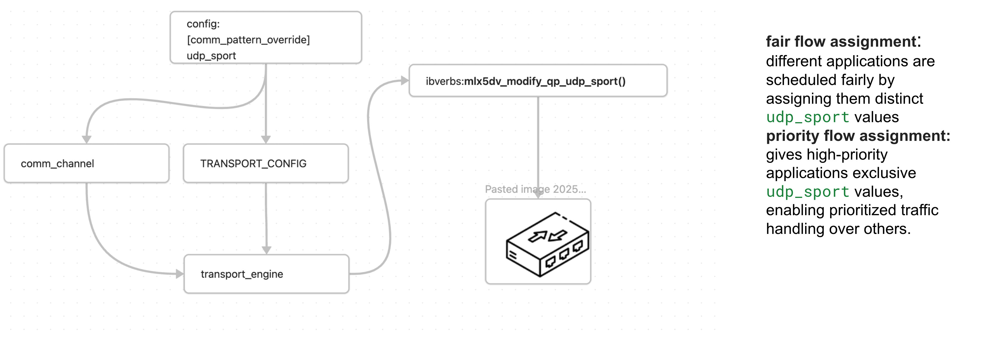
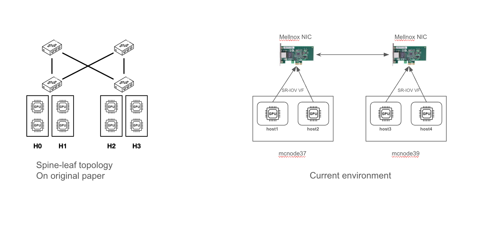
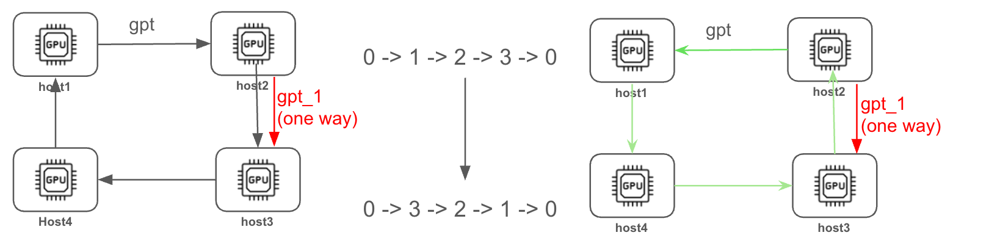
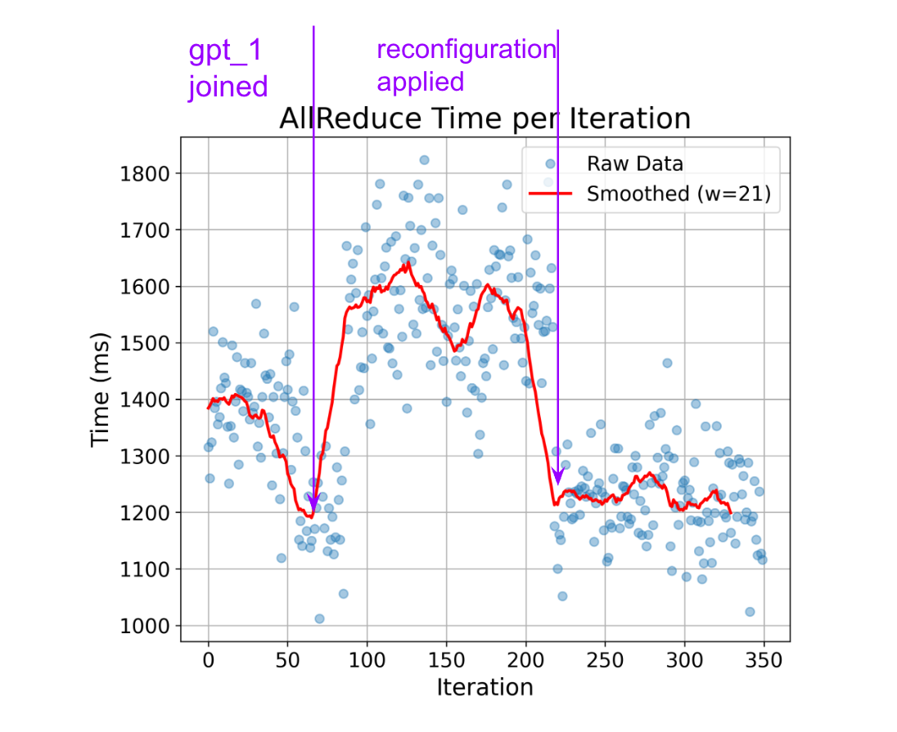
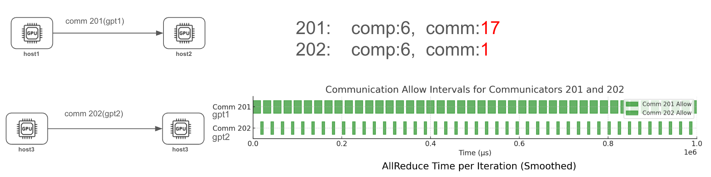
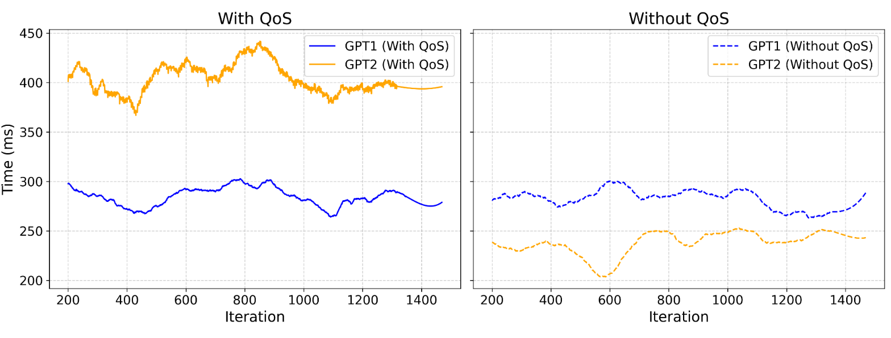
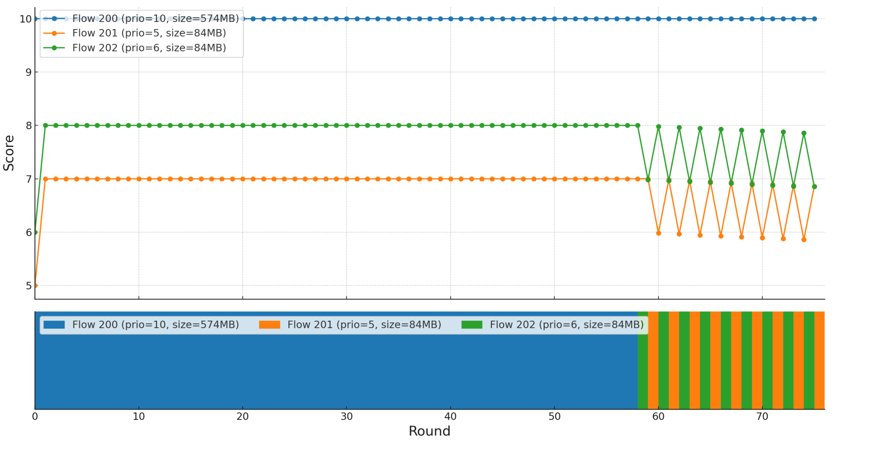

# MCCS document

This document records the research conducted on the MCCS framework. The work includes an analysis of the MCCS architecture, experiment reproduction on the ROCS testbed, the design of dynamic flow scheduling strategies, and performance evaluation.

## Table of Contents

- [MCCS Architecture](#mccs-architecture)
- [Experimental Setup on ROCS Testbed](#experimental-setup)
- [Reproduced Experiments](#reproduced-experiments)
- [Reproducibility](#reproducibility)
- [Runtime-aware Policy Generator](#runtime-aware-policy-generator)
- [Notes on Reconfiguration Experiment](#notes-on-reconfiguration-experiment)

## MCCS Architecture

### Overview

Below is the high-level architecture of MCCS. Before diving in, it is recommended to read the author's [code overview](./overview.md).



The MCCS system is split into two main paths:

- **Data Path**: Handles memory allocation and collective communication primitives.
- **Control Path**: Receives reconfiguration commands from the runtime.



When a user application invokes the MCCS interface (which mimics NCCL's API), the following process occurs:

1. The MCCS controller starts its main loop, initializes the core components (exchange engine, proxy engine, transport engine), registers transport configurations for inter-host communication, and passes the components to the runtime manager.

2. The user application calls `libmccs`, which uses the `ipc` library to communicate with the MCCS controller. A connection is established via the control socket, and a daemon engine is spawned to handle user commands.

3. Once initialized, the daemon engine serves as a proxy between user commands and MCCS. The proxy engine binds to each GPU and forwards inter-host communication through the transport engine, which is aware of the network topology.

### Flow Assignment Implementation

The MCCS paper implements two primary flow assignment policies:

- **Priority Flow Assignment**
- **Pair Flow Assignment**

Both rely on modifying ECMP (Equal-Cost Multi-Path) hash behavior, which is common in modern switch routing. Specifically, MCCS introduces a customized `udp_sport` field in each communication channel to influence flow routing across hosts.



## Experimental Setup

**Testbed**: ROCS cluster with 4 GPU nodes connected via RoCE.



The original setup in the paper uses a classical spine-leaf topology. On the ROCS testbed, we used four VMs connected via RoCE. The Mellanox NICs were virtualized using SR-IOV.

## Reproduced Experiments

The raw data is located in the [`experiment_raw_data`](../experiment_raw_data) directory. Reproduction instructions are provided in the [Reproducibility](#reproducibility) section.

### Dynamic Reconfiguration Experiment

The original paper (Figure 7) shows MCCS's ability to reconfigure the collective ring direction at runtime. We replicate this using a similar setup:



Since the paper doesn't specify how the background flow is generated, we implemented one-way traffic from host2 to host3 using `libibverbs` to simulate contention on the AllReduce ring path.

A reconfiguration command is sent to the MCCS service to change the ring direction. Results show that this dynamic reconfiguration effectively mitigates congestion.

Raw output: [traffic_gen_host1.stdout](../experiment_raw_data/ring-reconfig-test/setup4-dynamic/traffic_gen_host1.stdout)



### Traffic Scheduling Experiment

This experiment controls traffic using time-window-based policies to prioritize specific workloads:



We run two identical workloads, `gpt_1` and `gpt_2`, using the same configuration: [setup-4_gpt_1.toml](../workloads/setup-4_gpt_1.toml). Both run on the same physical host, but `gpt_1` is given higher priority via a QoS policy.

Compared to the baseline (no scheduling enforcement), `gpt_1` completes significantly faster due to prioritized access.

Raw data: [traffic_scheduling](../experiment_raw_data/traffic_scheduling/)



## Reproducibility

### Dynamic Reconfiguration

Run the following commands:

```bash
cd mCCS
just reconfig-ring-test
````

Steps:

1. Start receiver on `host3`.
2. Launch MCCS services on `host1` to `host4` and initiate `traffic_gen` workloads.
3. After 150 seconds, run the sender on `host2` to create one-way traffic.
4. After another 150 seconds, trigger the reconfiguration command.

The reconfiguration policy is described in [ring\_config](../src/mccs_examples/ring_config/) and resembles:

```toml
[[comm_patterns_reconfig]]
communicator_id = 600
channels = [
  { channel_id = 0, ring = [3, 2, 1, 0], udp_sport = [[4, 3, 49200], [0, 7, 49200]], net_dev = "mlx5_0" },
  { channel_id = 1, ring = [3, 2, 1, 0], udp_sport = [[4, 3, 49202], [0, 7, 49202]], net_dev = "mlx5_0" },
]
ib_traffic_class = 0
```

### Traffic Scheduling

Run the following commands:

```bash
cd mCCS
# With scheduling enforcement
just one-setup5-normal 1

# Without enforcement (baseline)
just one-setup5-woEnforce 1
```

Policy configuration:

```toml
[qos_schedule.schedule.201]
intervals = [[0, 17000], [23000, 40000]]
mode = "Allow"
enforce_step = 5

[qos_schedule.schedule.202]
intervals = [[0, 17000], [23000, 40000]]
mode = "Deny"
enforce_step = 5
```

Note: The `enforce_step` parameter is required for scheduling to take effect. It controls the polling frequency for checking allowed intervals.

## Runtime-aware Policy Generator

A major limitation of MCCS is that its policies are defined statically. To address this, we developed a runtime-aware policy generator: [dynamic-schedule](https://github.com/Zephyr596/dynamic-schedule).

This generator scores each flow based on priority, utilization fairness, and wait time:

$$
\text{Score}_f(t) = \alpha \times \pi_f + \beta \times \left(1 - \frac{u_f(t)}{U_{\text{max}}} \right) + \gamma \times \text{norm}(\omega_f(t))
$$

* **Priority term**: favors important flows.
* **Utilization term**: discourages overuse of congested links.
* **Wait time compensation**: prevents starvation.

Simulator experiments currently support single-path scheduling. Details can be found [here](https://coseu-obsidian.oss-cn-beijing.aliyuncs.com/MCCS/Dynamic_scheduler%20%281%29.pdf).



## Notes on Reconfiguration Experiment

The initial one-way traffic generator was unstable. A better simulation is achieved using `ib_send_bw`:

### Background Flow Simulation

**On host3 (receiver):**

```bash
ib_send_bw -d mlx5_0 -F --report_gbits -D 99999 --size 4096
```

**On host2 (sender):**

```bash
ib_send_bw 10.200.2.3 -d mlx5_0 -F --report_gbits -D 99999 --size 4096
```

### Monitoring Script

Since tools like `bmon` do not capture RDMA traffic, use the following script:

```bash
PORT_PATH="/sys/class/infiniband/mlx5_0/ports/1/counters"
echo "timestamp,tx_MBps,rx_MBps"

while true; do
    tx1=$(cat $PORT_PATH/port_xmit_data)
    rx1=$(cat $PORT_PATH/port_rcv_data)
    sleep 1
    tx2=$(cat $PORT_PATH/port_xmit_data)
    rx2=$(cat $PORT_PATH/port_rcv_data)

    tx_Bps=$(( (tx2 - tx1) * 4 ))
    rx_Bps=$(( (rx2 - rx1) * 4 ))
    tx_MBps=$(( tx_Bps / 1024 / 1024 ))
    rx_MBps=$(( rx_Bps / 1024 / 1024 ))
    echo "$(date +%H:%M:%S),$tx_MBps,$rx_MBps"
done
```

This method produces more reliable and visible one-way traffic for reconfiguration testing, although effective RDMA traffic monitoring remains challenging.

